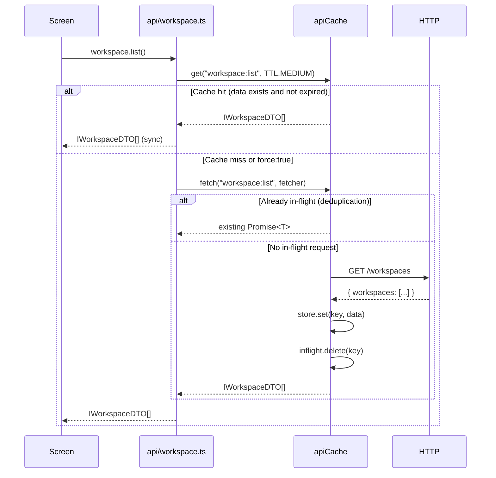
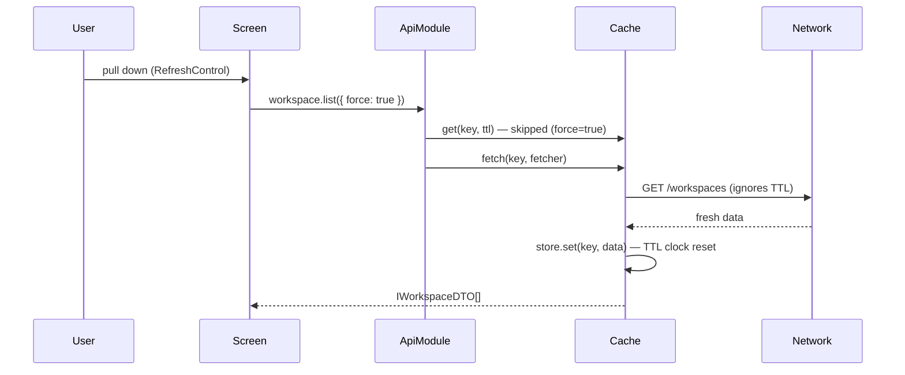
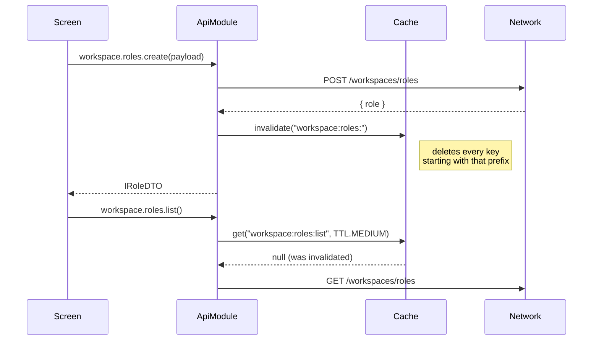

# API Cache — Design Reference

How the client-side cache works, why each decision was made, and the blueprint for an equivalent layer on the backend.

---

## 1. Client-side architecture

### 1.1 Two-map design

The entire cache is two `Map` objects living at module scope in `src/api/cache.ts`.  
They share the lifetime of the JS process, not a React component.

```
┌─────────────────────────────────────────────────────────┐
│  cache.ts  (module singleton)                           │
│                                                         │
│  store    Map<key, { data, fetchedAt }>                 │
│  inflight Map<key, Promise<T>>                          │
└─────────────────────────────────────────────────────────┘
```

`store` — persisted results, TTL-checked on read.  
`inflight` — promises currently waiting on the network.

### 1.2 Full request lifecycle



### 1.3 Pull-to-refresh (force bypass)



### 1.4 Write → invalidation



### 1.5 Session lifecycle

```
logInUser()                         logOutUser()
    │                                   │
    ▼                                   ▼
apiCache.clear()                   apiCache.clear()
    │                                   │
    ▼                                   ▼
workspaceReset()               userLoggedOut()
tokensInit()                   tokensReset()
userLoggedIn()                 workspaceReset()
                               persistor.purge()
```

`clear()` wipes both `store` and `inflight`, so a new user session never sees a prior user's data.

---

## 2. Cache key conventions

| Pattern | Example | Notes |
|---|---|---|
| `namespace:list` | `workspace:list` | No-param list |
| `namespace:list:qs` | `jobs:list:status=scheduled` | Serialised query string |
| `namespace:get:id` | `jobs:get:abc123` | Single entity |
| `namespace:sub:list` | `workspace:members:list` | Nested resource list |

Invalidation uses prefix matching — `invalidate('workspace:')` clears everything under the workspace namespace.

---

## 3. TTL table

| Constant | Value | Used for |
|---|---|---|
| `TTL.SHORT` | 30 s | Jobs, operational data that changes frequently |
| `TTL.MEDIUM` | 60 s | Workspaces, members, invitations, billing |
| `TTL.LONG` | 5 min | User profile, plans (rarely mutated) |

---

## 4. Multi-ID list calls — the hard problem

### 4.1 The issue

When a list endpoint accepts a variable set of IDs (e.g. `/jobs?ids=a,b,c`), naïve serialisation creates the wrong keys:

```
list({ ids: ['a', 'b', 'c'] }) → key: "jobs:list:ids=a%2Cb%2Cc"
list({ ids: ['c', 'a', 'b'] }) → key: "jobs:list:ids=c%2Ca%2Cb"
```

Same result, two cache entries, deduplication never fires.

### 4.2 Strategy 1 — sort IDs before keying (recommended for the client)

Sort array params before serialisation. Apply this in the API module, not by callers.

```ts
list(params?: { ids?: string[]; force?: boolean }): Promise<IJob[]> {
  const { force, ids, ...rest } = params ?? {};
  const qs = new URLSearchParams();
  if (ids?.length) qs.set('ids', [...ids].sort().join(','));
  // ...other params...
  const key = `jobs:list:${qs.toString()}`;
```

Cost: none. The server doesn't care about order; the network payload is identical.

### 4.3 Strategy 2 — read-through from individual item cache

For `GET /jobs?ids=a,b,c`, attempt to reconstruct from `jobs:get:a`, `jobs:get:b`, `jobs:get:c`.

```
ids = [a, b, c]
       │
       ▼
all in store and fresh?──yes──► return assembled array  (zero network)
       │
       no
       ▼
fetch missing ids only ──────► GET /jobs?ids=<missing>
store individual results
return full array
```

**When it works well:** detail screens that already fetched individual jobs; subsequent "load these 5 jobs" hits are free.

**When it breaks down:** list endpoints return different shapes than single-entity endpoints (extra pagination metadata, aggregates, filtered fields). Don't apply this strategy if the shapes differ.

### 4.4 Strategy 3 — coarse invalidation, fine-grained keying

Keep per-ID keys **and** a "list version" counter.

```
list-v:jobs  →  7          (increments on any write)
jobs:list:ids=a,b,c:v7  →  [ data ]
```

On any mutation, increment `list-v:jobs`. All list keys with a different version become stale without an explicit prefix wipe. This avoids invalidating an unrelated filtered list when only one job changes.

**Complexity cost is high.** Favour this only when list calls are expensive and frequently filtered in many different combinations.

### 4.5 Recommendation for this app

Use **Strategy 1** (sorted IDs) everywhere.  
Apply **Strategy 2** opportunistically only for screens where individual items are already cached (e.g. job detail → back → job list).  
Avoid Strategy 3 for now.

---

## 5. Backend equivalent — API-to-API calls

### 5.1 Why it's needed

Fonderie packages call each other inside request handlers:

```
POST /billing/checkout
  └─ withWorkspace  → getMember()          DB query
  └─ BillingService → subscription()       DB query  ← same result per workspace for 60 s
  └─ BillingService → resolveSubscriber()  DB query  ← same again
```

If a burst of 10 concurrent requests hits `/billing/checkout` for the same workspace, they each run all three queries independently. That's 30 DB round-trips for data that doesn't change in seconds.

### 5.2 Scope choices

| Scope | Isolation | Sharing | Eviction |
|---|---|---|---|
| **Per-request** (ctx.cache) | Perfect — no cross-user leakage | None | Automatic (request ends) |
| **Process-level Map** | Must key by workspaceId/userId | Shared across all requests | TTL required |
| **Redis** | Must key by workspaceId/userId | Shared across all instances | TTL or explicit |

**Recommendation:** start with a **process-level Map** (same pattern as the client). Add Redis only when you run multiple API instances.

### 5.3 Proposed backend cache module

```ts
// packages/core/src/lib/service-cache.ts

interface Entry { data: unknown; fetchedAt: number }

const store    = new Map<string, Entry>();
const inflight = new Map<string, Promise<unknown>>();

export const ServiceTTL = {
  EPHEMERAL: 5_000,    //  5 s  — rate-limit guards, per-request dedup
  SHORT:     30_000,   // 30 s  — subscription status, seat counts
  MEDIUM:    60_000,   //  1 min — workspace metadata, member lists
  LONG:      300_000,  //  5 min — plans, feature flags
} as const;

export const serviceCache = {
  get<T>(key: string, ttl: number): T | null {
    const e = store.get(key);
    if (!e || Date.now() - e.fetchedAt > ttl) return null;
    return e.data as T;
  },

  set<T>(key: string, data: T): void {
    store.set(key, { data, fetchedAt: Date.now() });
  },

  fetch<T>(key: string, fetcher: () => Promise<T>): Promise<T> {
    const existing = inflight.get(key);
    if (existing) return existing as Promise<T>;
    const req = fetcher().finally(() => inflight.delete(key));
    inflight.set(key, req);
    return req;
  },

  invalidate(prefix: string): void {
    for (const k of store.keys()) {
      if (k.startsWith(prefix)) store.delete(k);
    }
  },
};
```

### 5.4 Key scheme (backend)

Keys **must include the workspace ID** (and user ID where the result is user-scoped) to prevent cross-tenant leakage.

```
workspace:{workspaceId}:subscription
workspace:{workspaceId}:members:list
workspace:{workspaceId}:members:list:role={roleId}
workspace:{workspaceId}:roles:list
user:{userId}:profile
plans:list
```

### 5.5 Usage inside a service

```ts
// packages/billing/src/services/billing.service.ts

import { serviceCache, ServiceTTL } from '@fonderie/core';

async function subscription(workspaceId: string): Promise<ISubscription | null> {
  const key = `workspace:${workspaceId}:subscription`;
  const hit = serviceCache.get<ISubscription>(key, ServiceTTL.SHORT);
  if (hit) return hit;

  return serviceCache.fetch(key, async () => {
    const row = await db.query<ISubscription>(
      'SELECT * FROM fonderie_subscriptions WHERE workspace_id = $1',
      [workspaceId],
    );
    if (row) serviceCache.set(key, row);
    return row ?? null;
  });
}
```

### 5.6 Invalidation on write

```ts
async function cancelSubscription(workspaceId: string): Promise<void> {
  await db.query('UPDATE fonderie_subscriptions SET status = $1 WHERE workspace_id = $2',
    ['cancelled', workspaceId]);
  serviceCache.invalidate(`workspace:${workspaceId}:subscription`);
}
```

### 5.7 Multi-ID list on the backend — full decision tree

```
Caller needs items A, B, C
         │
         ▼
Sort IDs → key = "workspace:W:jobs:list:ids=A,B,C"
         │
         ▼
 Cache hit? ──yes──► return immediately
         │
        no
         ▼
Check individual keys: jobs:get:A, jobs:get:B, jobs:get:C
All present & fresh? ──yes──► assemble, store list key, return
         │
        no
         ▼
missing = IDs not in individual cache
         │
         ▼
Fetch only missing IDs from DB / downstream service
         │
         ▼
Store each item under jobs:get:{id}
Store assembled result under list key
Return full array
```

**Implementation sketch:**

```ts
async function getJobsByIds(
  workspaceId: string,
  ids: string[],
): Promise<IJob[]> {
  const sorted  = [...ids].sort();
  const listKey = `workspace:${workspaceId}:jobs:list:ids=${sorted.join(',')}`;

  const listHit = serviceCache.get<IJob[]>(listKey, ServiceTTL.SHORT);
  if (listHit) return listHit;

  // Try to assemble from individual caches first.
  const resolved: IJob[] = [];
  const missing:  string[] = [];

  for (const id of sorted) {
    const item = serviceCache.get<IJob>(`workspace:${workspaceId}:jobs:get:${id}`, ServiceTTL.SHORT);
    item ? resolved.push(item) : missing.push(id);
  }

  if (missing.length > 0) {
    const fetched = await db.query<IJob[]>(
      'SELECT * FROM fonderie_jobs WHERE id = ANY($1) AND workspace_id = $2',
      [missing, workspaceId],
    );
    for (const job of fetched) {
      serviceCache.set(`workspace:${workspaceId}:jobs:get:${job.id}`, job);
      resolved.push(job);
    }
  }

  // Re-sort to original order before storing the list result.
  const result = sorted.map((id) => resolved.find((j) => j.id === id)!).filter(Boolean);
  serviceCache.set(listKey, result);
  return result;
}
```

### 5.8 Cache invalidation event flow (backend)

When a write happens deeper in the stack, the owning service is responsible for invalidating. No caller should reach into another service's cache.

```
BillingService.cancelSubscription(wid)
  │
  ├─ db.query(UPDATE...)
  └─ serviceCache.invalidate(`workspace:${wid}:subscription`)

WorkspaceService.removeMember(wid, uid)
  │
  ├─ db.query(DELETE...)
  └─ serviceCache.invalidate(`workspace:${wid}:members:`)
      (clears list + any role-filtered variants)
```

### 5.9 When to add Redis

Stick with the in-process Map until **any** of these are true:

- You run ≥ 2 API instances (cache is not shared, each instance cold-starts)
- A cache entry is expensive to recompute and the cost should be shared across instances
- You need cache entries to survive a process restart (e.g. feature flags)

When you move to Redis, the `serviceCache` interface stays identical — only the backing store changes. The key scheme does not change.

---

## 6. What the client cache does NOT do (and the backend must)

| Concern | Client | Backend |
|---|---|---|
| Cross-user isolation | N/A — one user per process | **Must** include workspaceId/userId in every key |
| Sensitive data at rest | Ephemeral JS memory | Same for in-process; Redis needs encryption-at-rest if PII |
| Cache stampede on cold start | Low risk — single user | `fetch()` deduplication handles it per-process; Redis needs a distributed lock for critical paths |
| TTL on inflight requests | Inflight cleared on settle | Same — `finally(() => inflight.delete(key))` |
| Invalidation on external writes | Only own writes | Must also invalidate when a webhook or background job mutates data |
